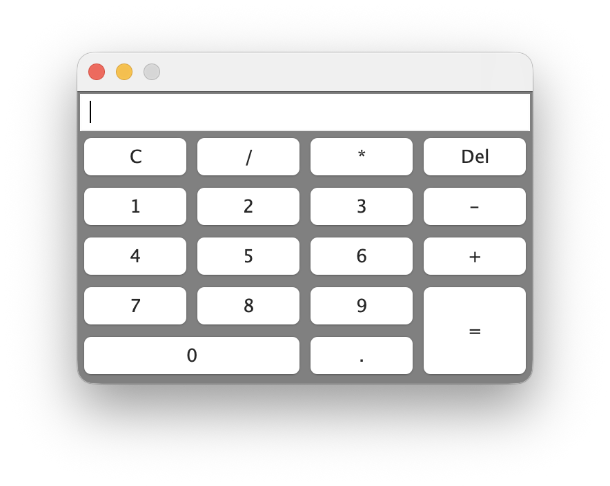
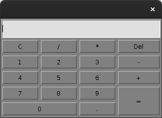

# calculator_java

A simple **Object-Oriented Programming (OOP)** calculator built in **Java** with an **AWT-based GUI**.  
This project demonstrates event-driven programming, GUI design with `GridBagLayout`, and core OOP concepts such as encapsulation, abstraction, and polymorphism.  

<p align="center">
  
  &nbsp;&nbsp;&nbsp;
  
</p>


---

## ✨ Features
- Basic arithmetic: addition, subtraction, multiplication, division  
- Support for decimal numbers  
- Error handling:
  - Division by zero  
  - Multiple decimal points  
  - Trailing operators/signs  
- Utilities: clear (C), delete (backspace), and reset  
- Both **button** and **keyboard** input supported  
- Clean numeric formatting:
  - Removes trailing zeros  
  - Switches to scientific notation for very large/small results  

---

## 📖 Documentation
A detailed [project report](report_Calculator.pdf) is included, covering:
- System design and architecture  
- GUI layout and event model  
- Input validation and error handling  
- Testing strategy and representative cases  
- Limitations and future enhancements  

---

## 🧰 Requirements
- JDK 8+ (tested on JDK 17)

## 🚀 How to Build & Run

### Option 1: javac / java
```bash
git clone https://github.com/mskayacioglu/calculator_java.git
cd calculator_java
javac Calculator.java
java Calculator

